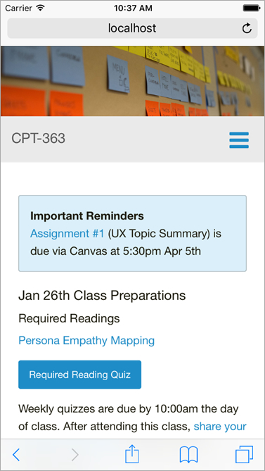

Welcome to the multi-device friendly course hub for CPT-363 Spring 2016. To help orientate yourself to the course, explore the [course syllabus](../../syllabus).

Any required preparations before each class will be posted here by Thursday of the previous week. Assigned weekly reading quizzes must be submitted before 10:00am the day of each class, and please bring a copy of your answers to class to help facilitate possible discussion.

A summary of presented materials will usually be posted the day after class.

Please send your comments and feedback to <somename@somewhere.edu>.

  
_Figure 1. Course hub viewed on an Apple iPhone_
