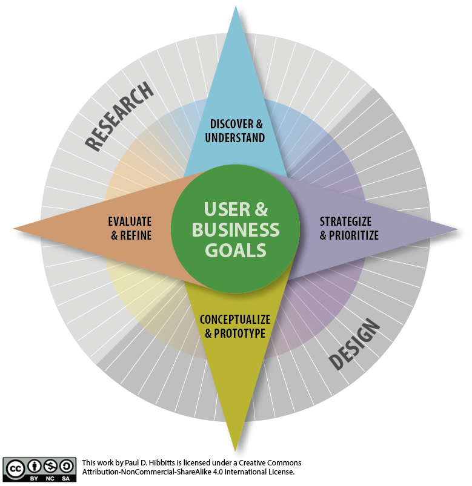

## What does a holistic user experience design process look like?
[Software Development Processes](../../presentations/module-02?target=_blank#/module-02-4)  
[User Experience Design Processes](../../presentations/module-02?target=_blank#/module-02-5)  
[Our Design Process (aka Toolkit)](../../presentations/module-02?target=_blank#/module-02-6)  

===

## **What does a holistic user experience design process look like?**

### Summaries and Questions  
[May 16th Class One-minute Summaries](https://sso.canvaslms.com/courses/1413912/assignments/9519525)

### Presented Slides  
[presentation="presentations/module-02"]

### CPT-363 UX Design Process/Toolkit

### Handouts
[Product Reaction Cards](https://sso.canvaslms.com/courses/1413912/files/folder/Handouts/Product%20Reaction%20Cards)  

### Assignments
[Course Reflection Log](https://sso.canvaslms.com/courses/1413912/assignments/9519528)  

### Recommended Reading  
[embedly url="https://uxplanet.org/the-evolution-of-ux-process-methodology-47f52557178b"]
