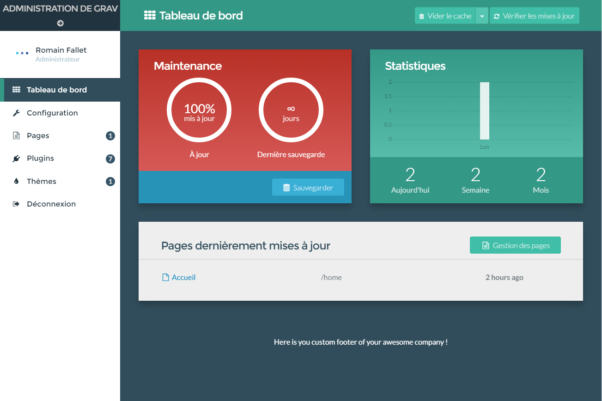

# Grav Customadmin Grav2 Plugin

This is a custom version of the [Customadmin plugin](https://github.com/numee/grav-plugin-customadmin) with added support for CSS and JS customization in Grav 2 (Admin2) while remaining backward compatible with Admin1.

Admin2 (the Grav 2 administration panel) is a SvelteKit-based SPA that bypasses Grav's standard asset pipeline, so CSS is injected into `<head>` and JS is injected before `</body>` via an output buffer. Admin1 continues to use the standard Grav assets pipeline.



# Installation

Put the content of this repository in a folder called "customadmin-grav2" in:
```
user/plugins/
```

# Usage

Update these two files to customize the admin panel:
```
user/plugins/customadmin-grav2/customadmin.css
```
```
user/plugins/customadmin-grav2/customadmin.js
```
